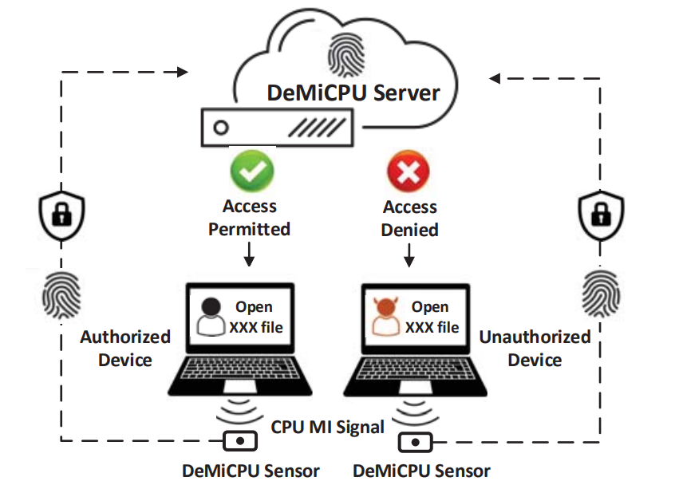
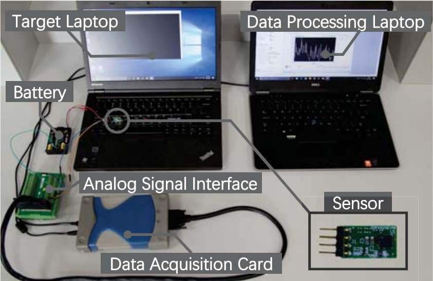

# What is DeMiCPU?

With the widespread use of smart devices, device authentication has received much attention. One popular method for device authentication is to utilize internally-measured device fingerprints, such as device ID, software or hardware-based characteristics. In this paper, we propose ***DeMiCPU***, a stimulation-response-based device fingerprinting technique that relies on externally-measured information, i.e., magnetic induction (MI) signals emitted from the CPU module that consists of the CPU chip and its affiliated power supply circuits. The key insight of ***DeMiCPU*** is that hardware discrepancies essentially exist among CPU modules and thus the corresponding MI signals make promising device fingerprints, which are difficult to be modified or mimicked. We design a stimulation and a discrepancy extraction scheme and evaluate them with 90 mobile devices, including 70 laptops (among which 30 are of totally identical CPU and operating system) and 20 smartphones. The results show that ***DeMiCPU*** can achieve 99.1% precision and recall on average, and 98.6% precision and recall for the 30 identical devices, with a fingerprinting time of 0.6 s. In addition, the performance can be further improved to 99.9% with multi-round fingerprinting.


## How does DeMiCPU work？

<center>
    
    <br>
</center>


## Test Devices

The following devices have been tested in our experiments with the experimental parameters provided in our paper. This table shows all experimental devices and their detailed specifications. A total of 90 devices are used, including 70 laptops and 20 smartphones. Among them, 1-30, 31-33, 50-51, 84-85 and 88-89 are of the same model and OS respectively.

| No. | Manufacturer          | Model         | OS | CPU Model | Test Point |
| ------------ | -------------- | ------------------ | --------------- | ---------------------- | ----------------------- |
| 1-30        | Lenovo      | ThinkPad T430          |  Win 7           | i5-3320M                      | S                       |
| 31-33   | Lenovo | ThinkPad T440p | Win 7       | i5-4210M              | S                      |
| 34      | Lenovo | G480 | Win 7       | i5-3210M              | R                      |
| 35      | Lenovo | G480     | Win 10      | i5-3210M              | R                      |
| 36       | Lenovo | ThinkPad X201 | Win 10      | i5-540M               | F6                     |
| 37       | Lenovo       | ThinkPad T440 | Debian      | i7-4500U              | N                      |
| 38       | Lenovo    | ThinkPad W520 | GNOME       | i7-2760QM    | E                      |
| 39      | Lenovo | ThinkPad Edge E431 | Win 10      | i7-3632QM             | S                      |
| 40       | Lenovo  | ThinkPad Edge E530 | Win 10      | i5-3210M            | S                      |
| 41      | Lenovo | IdeaPad Y470 | Win 7 | i5-2450M              | E                      |
| 42      | Lenovo  | IdeaPad Y485 | Win 7 | A8-4500M              | F5                     |
| 43     | Lenovo | Yoga2 13 | Win 10   | i5-4210U              | F4                     |
| 44      | Lenovo  | Yoga 710 | Win 10   | i5-6200U              | O                      |
| 45      | Lenovo | U430P    | Win 10   | i5-4200U              | F1                   |
| 46     | Lenovo     | Erazer Z410 | Win 10 | i7-4702MQ             | 6                      |
| 47        | Lenovo       | E47a | Win 7        | i5-2520M            | S                      |
| 48 | Lenovo | X200 7455 | GNOME | Intel P8600 | F |
| 49 | Lenovo | R720 | Win 10 | i5-7300HQ | 7 |
| 50-51 | Apple | MacBook Air A1466 | OS x | i5-4260U | W&E |
| 52 | Apple | MacBook Pro A1707 | OS x | i7-6920HQ | W&E |
| 53 | Apple | MacBook Pro A1502 | OS x | i5-4278U | C |
| 54 | Dell | Inspiron N4050 | Win 7 | i3-2350M | F |
| 55 | Dell | Inspiron N5110 | Win 7 | i5-2450M | F |
| 56 | Dell | Inspiron 14 7460 | Win 10 | i5-7200U | 6 |
| 57 | Dell | Inspiron 15R 5520 | Win 10 | i5-3210M | Fn |
| 58 | Dell | Inspiron 15 7559 | Win 10 | i5-6300HQ | F6 |
| 59 | Dell | Latitude E4300 | Win XP | Intel SP9400 | F |
| 60 | Dell | Latitude E7440 | Win 10 | i5-4200U | E&R |
| 61 | Dell | XPS13 | Win 10 | i5-3317U | 6 |
| 62 | Dell | XPS14 L421X | Win 10 | i7-3537U | 4 |
| 63 | Asus | Eee PC 1201HA | Win 7 | Intel Z520 | A |
| 64 | Asus | N46V | Win 8.1 | i5-3210M | B&N |
| 65 | Asus | X450EI323VC-SL | Win 10 | i5-3230M | F |
| 66 | Acer | V5-471G | Win 7 | i5-3337U | D |
| 67 | HP | TPN-Q173 | Win 10 | i5-6300HQ | Backspace |
| 68 | MSI | MS16-H8 | Win 10 | i7-6700HQ | Scroll Lock |
| 69 | Sony | SVT131A11T | Win 7 | i5-3317U | X |
| 70 | Sony | SVT131A11T | Win 10 | i5-3317U | X |
| 71 | Mi | 5 | Android 6.0 | Snapdragon 820 | BVK<sup>1</sup> |
| 72 | Mi | 5S | Android 6.0 | Snapdragon 820 | BVK<sup>1</sup> |
| 73 | Huawei | Honor 5X | Android 5.1 | Snapdragon 616 | BVK<sup>1</sup> |
| 74 | Huawei | Honor 8 | Android 6.0 | Kirin 950 | BVK<sup>1</sup> |
| 75 | Huawei | Honor V8 | Android 6.0 | Kirin 950 | BVK<sup>1</sup> |
| 76 | Huawei | P9 | Android 6.0 | Kirin 955 | BVK<sup>1</sup> |
| 77 | LG | Nexus 5 | Android 4.4 | Snapdragon 800 | BVK<sup>1</sup> |
| 78 | LG | Nexus 5X | Android 6.0 | Snapdragon 808 | BVK<sup>1</sup> |
| 79 | Vivo | X7 | Android 5.1 | Snapdragon 652 | BVK<sup>1</sup> |
| 80 | Samsung | Galaxy S6 | Android 5.0 | Exynos 7420 | BVK<sup>1</sup> |
| 81 | Apple | iPhone 6 | iOS 10.2.1 | Apple A8 | BPK<sup>2</sup> |
| 82 | Apple | iPhone 6 | iOS 11.0.3 | Apple A8 | BPK<sup>2</sup> |
| 83 | Apple | iPhone 6 Plus | iOS 11.1.1 | Apple A8 | BPK<sup>2</sup> |
| 84-85 | Apple | iPhone 6s | iOS 10.3.3 | Apple A9 | BPK<sup>2</sup> |
| 86 | Apple | iPhone 6s | iOS 10.2.1 | Apple A9 | BPK<sup>2</sup> |
| 87 | Apple | iPhone 6s | iOS 11.2.1 | Apple A9 | BPK<sup>2</sup> |
| 88-89 | Apple | iPhone SE | iOS 11.2.1 | Apple A9 | BPK<sup>2</sup> |
| 90 | Apple | iPhone 7 Plus | iOS 10.3.3 | Apple A10 | BPK<sup>2</sup> |

<sup>1</sup> BVK = Beside Volume Key 

<sup>2</sup> BPK = Beside Power Key

## How to generate the Fingerprints?

 As shown in the following figure, we collect MI signals emitted from the CPU models with a magnetic-field sensor DRV425 from Texas Instruments (TI), and conduct AD conversion with a data acquisition (DAQ) card U2541A from Keysight at a sampling rate of 200 kHz.

<center>
    
    <br>
    <div style="color:orange; border-bottom: 1px solid #d9d9d9;
    display: inline-block;
    color: #999;
    padding: 2px;"></div>
</center>


# Read our paper

Yushi Cheng, Xiaoyu Ji<sup>*</sup>, Juchuan Zhang, Wenyuan Xu, Yi-Chao Chen. [**DeMiCPU: Device Fingerprinting with Magnetic Signals Radiated by CPU**](https://dl.acm.org/doi/10.1145/3319535.3339810). *Proceedings of the 2019 ACM SIGSAC Conference on Computer and Communications Security.(CCS2019)* , November, 2019.[[pdf]](http://www.usslab.org/papers/DeMiCPU.pdf)

<sup>*</sup> *Corresponding Author*

# Citation

```
@inproceedings{cheng2019demicpu,
  title={Demicpu: Device fingerprinting with magnetic signals radiated by cpu},
  author={Cheng, Yushi and Ji, Xiaoyu and Zhang, Juchuan and Xu, Wenyuan and Chen, Yi-Chao},
  booktitle={Proceedings of the 2019 ACM SIGSAC Conference on Computer and Communications Security},
  pages={1149--1170},
  year={2019}
}
```


# Contact
* Prof. Wenyuan Xu (<wyxu@zju.edu.cn>)
* Prof. Xiaoyu Ji (<xji@zju.edu.cn>)

# Powered by

<table bgcolor="white">
<tr valign="middle">
<td width="50%" align="center" colspan="2">
 <a href="http://usslab.org">Ubiquitous System Security Laboratory (USSLab) 
</td>
<td width="50%" align="center" colspan="2">
  <a href="http://www.zju.edu.cn/english">Zhejiang University 
</td>
</tr>
<tr valign="middle">
<td width="50%" align="center" colspan="2">
  <a href="http://usslab.org"></a>
  <a href="http://usslab.org"></a>
</td>
<td width="50%" align="center" colspan="2">
  <a href="http://www.zju.edu.cn/english/"></a>
  <a href="http://www.zju.edu.cn/english/"></a>
</td>
</tr>
</table>